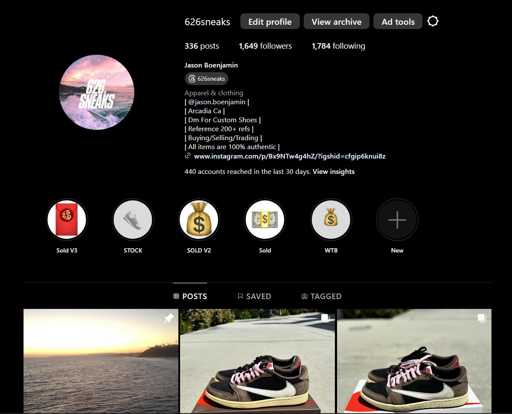

# Jason A. Boenjamin

## Table of Contents

- [Jason A. Boenjamin](#jason-a-boenjamin)
  - [Table of Contents](#table-of-contents)
  - [About Me](#about-me)
  - [Other interests](#other-interests)
  - [List of Classes I have taken](#list-of-classes-i-have-taken)
    - [From favorite to least-favorite](#from-favorite-to-least-favorite)
  - [Things I Have Yet To Do](#things-i-have-yet-to-do)

## About Me

My name is **Jason Boenjamin** and I am a third year transfer student at ***UCSD*** majoring in Computer Science. I was born on May 10th, 2003, in Arcadia, CA and attended Pasadena City College. The San Gabriel Valley will always have a special place in my heart, especially because of the amazing food there. 

Also, I run a sneaker business on Instagram, with the handle @626sneaks. 

[626sneaks Link](https://www.instagram.com/626sneaks/?hl=en)

Attached *below* is an image about the business. 

On the topic of sneakers, my favorite quote comes from the Great Kobe Bryant > Leave the game better than you found it. And when it comes time for you to leave, leave a legend."

This quote is my idealogy for the way I want to live my life. I want to leave a legacy to those around me. Whether it be a simple interaction with me or a group project. I want to have a positive impact on every person I come across. 

Speaking of quotes, my favorite line of *code* is `cout << "Hello World\n";`

## Other interests

* Basketball
* Football
* Tuba
* Guitar
* Fixing electronics
* PC Parts

## List of Classes I have taken 
### From favorite to least-favorite

1. CSE100
2. MUS7
3. CSE101
4. CSE30
5. CSE15L
6. CSE21
7. MATH183

## Things I Have Yet To Do

- [x] Fix a broken Apple Watch
- [ ] Do more Leetcode
- [ ] Fix my resume
- [ ] Work in group
- [ ] Obtain KD 4 Galaxy Size 10
- [ ] Obtain Aasics Gel-Kayano14 Size 9.5 
